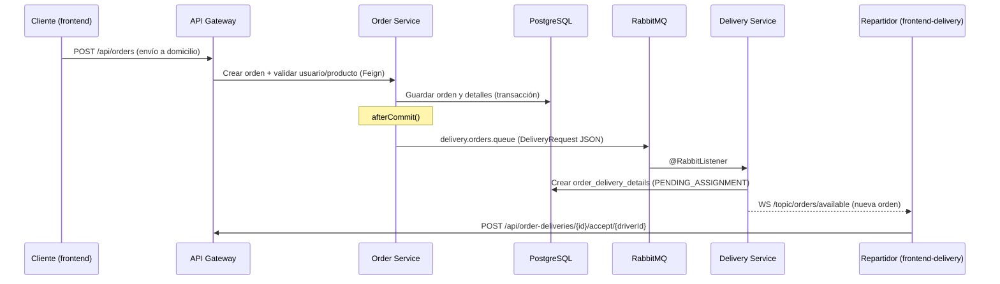
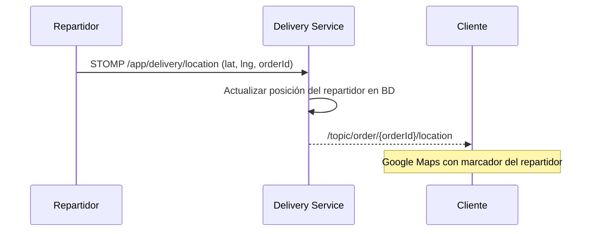

# Areska — Plataforma E-Commerce con Microservicios

**Areska** es una plataforma de comercio electrónico (periféricos gaming) construida con **arquitectura de microservicios**. Incluye dos frontends (tienda para clientes y app para repartidores), un API Gateway centralizado y comunicación en tiempo real entre servicios mediante **RabbitMQ** y **WebSockets STOMP**.

El núcleo del proyecto es la coordinación **Order Service ↔ Delivery Service**: cuando un cliente pide con envío a domicilio, la orden se persiste y se notifica de forma asíncrona al servicio de delivery; luego, el repartidor transmite su ubicación GPS en vivo y el cliente la sigue en un mapa en tiempo real.

---

## Arquitectura general

```
┌─────────────────┐     ┌─────────────────┐
│  frontend       │     │ frontend-delivery│
│  (cliente)      │     │ (repartidor)     │
│  :3000          │     │ :3001            │
└────────┬────────┘     └────────┬─────────┘
         │ REST + WebSocket       │ REST + WebSocket
         └───────────┬────────────┘
                     ▼
         ┌───────────────────────┐
         │   API Gateway :8090   │
         │   Firebase Auth       │
         └───────────┬───────────┘
                     │ Eureka (service discovery)
     ┌───────────────┼───────────────┐
     ▼               ▼               ▼
┌─────────┐   ┌───────────┐   ┌──────────┐
│  User   │   │  Product  │   │ Payment  │
│  :8081  │   │  :8082    │   │  :8083   │
└─────────┘   └───────────┘   └──────────┘
                     │
              ┌──────┴──────┐
              ▼             ▼
        ┌──────────┐  ┌─────────────┐
        │  Order   │  │  Delivery   │
        │  :8084   │  │  :8085      │
        └────┬─────┘  └──────▲──────┘
             │               │
             │  RabbitMQ     │
             └──────────────►│
                  delivery.orders.queue

Infraestructura: PostgreSQL · RabbitMQ · Eureka · Config Server · Zipkin · Prometheus · Grafana
```

| Capa | Componentes |
|------|-------------|
| **Frontends** | `frontend` (tienda + admin) · `frontend-delivery` (app repartidor) |
| **Gateway** | Punto de entrada único, autenticación Firebase, CORS, enrutamiento |
| **Microservicios** | User · Product · Payment · Order · Delivery |
| **Mensajería** | RabbitMQ — desacoplamiento Order → Delivery |
| **Tiempo real** | WebSocket STOMP/SockJS — mapa GPS y estados de entrega |
| **Observabilidad** | Zipkin (trazas) · Prometheus + Grafana (métricas) |

---

## Flujo estrella: Order → RabbitMQ → Delivery

Cuando un cliente crea una orden con `pickup_method: "delivery"`, los dos servicios se coordinan sin acoplamiento directo:



### Detalles técnicos

| Elemento | Valor |
|----------|-------|
| **Cola** | `delivery.orders.queue` (durable) |
| **Productor** | `areska-order-service` → `DeliveryProducer` |
| **Consumidor** | `areska-delivery-service` → `DeliveryConsumer` |
| **Formato** | JSON (`orderId`, `userId`, dirección, coordenadas, notas) |
| **Garantía** | El mensaje se envía **después del commit** en BD para evitar inconsistencias |

El **Order Service** gestiona el ciclo de negocio de la orden (`pending` → `confirmed` → `preparing` → `ready` → `completed`). El **Delivery Service** gestiona la logística por separado (`PENDING_ASSIGNMENT` → `ASSIGNED` → `ACCEPTED` → `OUT_FOR_DELIVERY` → `DELIVERED`).

---

## Flujo estrella: WebSocket y mapa en tiempo real

El seguimiento GPS usa **STOMP sobre SockJS**, enrutado por el Gateway:

| Ruta Gateway | Servicio | Endpoint backend |
|--------------|----------|------------------|
| `/api/ws/**` | Order Service | Chat y estado de orden |
| `/api/delivery-ws/**` | Delivery Service | GPS, tracking y notificaciones a repartidores |

### Mapa en vivo (cliente ↔ repartidor)



| Destino STOMP | Dirección | Propósito |
|---------------|-----------|-----------|
| `/app/delivery/location` | Repartidor → servidor | Envía coordenadas GPS |
| `/topic/order/{orderId}/location` | Servidor → cliente | Actualiza el mapa en tiempo real |
| `/topic/order/{orderId}/tracking` | Servidor → cliente | Hitos de la entrega |
| `/topic/orders/available` | Servidor → repartidores | Nueva orden disponible |
| `/topic/orders/taken/{deliveryId}` | Servidor → repartidores | Orden ya aceptada por otro |

**Componentes clave:**
- Repartidor: `frontend-delivery/hooks/use-delivery-location-sender.ts` + `delivery-map.tsx`
- Cliente: `frontend/hooks/use-websocket-tracking.ts` + `components/tracking/delivery-map.tsx`
- Backend: `DeliveryTrackingController` → `DeliveryTrackingService`

---

## Microservicios

| Servicio | Puerto | Responsabilidad |
|----------|--------|-----------------|
| **Config Server** | 8888 | Configuración centralizada (`config-repo/`) |
| **Eureka Server** | 8761 | Service discovery |
| **User Service** | 8081 | Usuarios, roles, sync con Firebase |
| **Product Service** | 8082 | Catálogo, categorías, stock |
| **Payment Service** | 8083 | Pagos vinculados a órdenes |
| **Order Service** | 8084 | Órdenes, chat, productor RabbitMQ |
| **Delivery Service** | 8085 | Repartidores, entregas, consumidor RabbitMQ, WebSocket GPS |
| **API Gateway** | 8090 | Entrada única, JWT Firebase, enrutamiento |

### Comunicación entre servicios

| Patrón | Uso |
|--------|-----|
| **REST vía Gateway** | Frontends → microservicios |
| **OpenFeign + Eureka** | Order → User/Product; Payment → Order (validación síncrona) |
| **RabbitMQ** | Order → Delivery (creación asíncrona de entrega) |
| **WebSocket STOMP** | Estados de entrega, notificaciones a repartidores, GPS en mapa |
| **PostgreSQL compartida** | Base de datos `areska` (separación lógica por tablas) |

---

## Stack tecnológico

| Área | Tecnologías |
|------|-------------|
| **Backend** | Java 17, Spring Boot, Spring Cloud (Gateway, Config, Eureka), JPA, OpenFeign |
| **Mensajería** | Spring AMQP, RabbitMQ 3 |
| **Tiempo real** | Spring WebSocket, STOMP, SockJS |
| **Auth** | Firebase Authentication (Admin SDK en gateway, Client SDK en frontends) |
| **Frontend tienda** | Next.js 15, React 19, TypeScript, TanStack Query, Google Maps |
| **Frontend delivery** | Next.js 14, React 18, NextUI, Google Maps, geolocalización |
| **Observabilidad** | Zipkin, Prometheus, Grafana, Spring Actuator |
| **Despliegue** | Docker Compose, Maven |

---

## Requisitos previos

- [Docker Desktop](https://www.docker.com/products/docker-desktop/) instalado y en ejecución
- [Node.js + pnpm](https://pnpm.io/installation)
- PowerShell (Windows)
- Java 17+ y Maven (solo para arranque local sin Docker)

---

## Inicio rápido

### 1. Configurar backend

**Variables de entorno** — dentro de `backend/`:
```powershell
Copy-Item backend\.env.example backend\.env
```

**Firebase** — descarga la clave de servicio desde Firebase Console → Cuentas de servicio y colócala en:
```
backend/areska-gateway-service/firebase-service-account.json
```

### 2. Levantar backend (Docker — recomendado)

```powershell
cd backend
docker compose up -d
```

Espera 3–4 minutos y verifica:
```powershell
docker compose ps
docker compose logs -f <nombre-contenedor>
```

**Orden de arranque automático:**

| # | Servicio | Puerto | Depende de |
|---|----------|--------|------------|
| 1 | postgres, rabbitmq, zipkin, zookeeper | 5433, 5672, 9411, 2181 | — |
| 2 | kafka | 9092 | zookeeper |
| 3 | config-server | 8888 | — |
| 4 | eureka-server | 8761 | config-server |
| 5 | user, product, payment | 8081–8083 | config, eureka, postgres |
| 6 | order, delivery | 8084–8085 | config, eureka, postgres, rabbitmq |
| 7 | gateway-service | 8090 | config, eureka, user, product, order |
| 8 | prometheus, grafana | 9090, 3030 | servicios activos |

### 3. Levantar frontends

**Tienda (puerto 3000):**
```powershell
cd frontend
pnpm install
pnpm dev
```

**App repartidor (puerto 3001):**
```powershell
cd frontend-delivery
pnpm install
pnpm dev
```

### Alternativas de arranque del backend

**Script PowerShell** (requiere Postgres y RabbitMQ activos):
```powershell
cd backend
.\start-all-services.ps1
```

**Manual** — levanta en terminales separadas: Config Server → Eureka → User/Product/Payment → Order/Delivery → Gateway. Ver sección de desarrollo local en el historial del repo si necesitas el detalle paso a paso.

---

## URLs de acceso

| Servicio | URL | Credenciales |
|----------|-----|--------------|
| Frontend tienda | http://localhost:3000 | — |
| Frontend delivery | http://localhost:3001 | — |
| API Gateway | http://localhost:8090 | — |
| Eureka Dashboard | http://localhost:8761 | — |
| RabbitMQ Panel | http://localhost:15672 | guest / guest |
| Zipkin | http://localhost:9411 | — |
| Prometheus | http://localhost:9090 | — |
| Grafana | http://localhost:3030 | admin / admin123 |

**Swagger UI por servicio:**

| Servicio | URL |
|----------|-----|
| User | http://localhost:8081/swagger-ui.html |
| Product | http://localhost:8082/swagger-ui.html |
| Payment | http://localhost:8083/swagger-ui.html |
| Order | http://localhost:8084/swagger-ui.html |
| Delivery | http://localhost:8085/swagger-ui.html |

---

## Detener servicios

```powershell
cd backend
docker compose down
```

Para eliminar también los datos de la base de datos:
```powershell
docker compose down -v
```

---

## Estructura del repositorio

```
Micro-Areska/
├── backend/          → ver backend/README.md
├── frontend/         → ver frontend/README.md
└── frontend-delivery/ → ver frontend-delivery/README.md
```

| Carpeta | README | Contenido |
|---------|--------|-----------|
| `backend/` | [backend/README.md](backend/README.md) | Microservicios, RabbitMQ, WebSocket, Docker, Gateway |
| `frontend/` | [frontend/README.md](frontend/README.md) | Tienda, admin, mapa de seguimiento del cliente |
| `frontend-delivery/` | [frontend-delivery/README.md](frontend-delivery/README.md) | App repartidor, envío GPS, notificaciones de órdenes |
