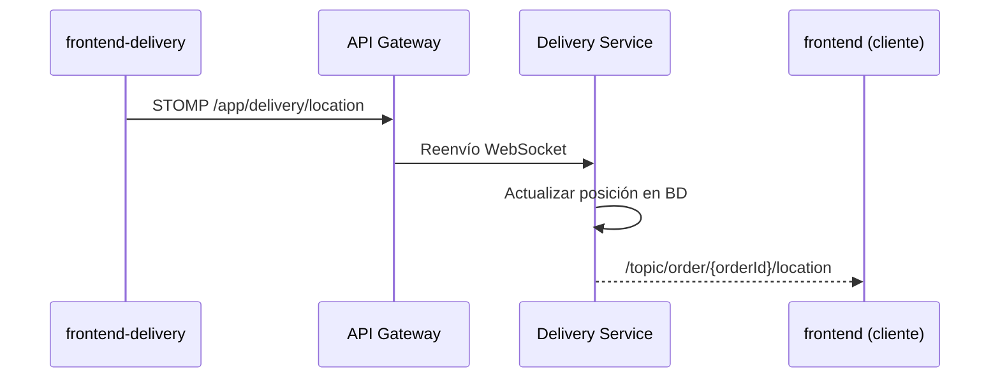

# Frontend Delivery — App para repartidores

Aplicación **Next.js 14** para **repartidores** de Areska: recibir órdenes en tiempo real, aceptar entregas, transmitir ubicación GPS y gestionar el recorrido en el mapa.

> Documentación general: [README raíz](../README.md) · Backend: [backend/README.md](../backend/README.md) · Tienda cliente: [frontend/README.md](../frontend/README.md)

---

## Rol en el sistema

```
Repartidor (este frontend :3001)
    │
    ├── REST  → API Gateway :8090/api
    │           (aceptar órdenes, actualizar estados, perfil)
    │
    └── WebSocket STOMP → /api/delivery-ws
                          (enviar GPS + recibir nuevas órdenes)
```

Es el lado **emisor** del flujo de mapa en tiempo real: publica coordenadas en `/app/delivery/location` y el cliente las recibe en `/topic/order/{orderId}/location`.

---

## Funcionalidades

- Login y registro con Firebase
- Dashboard con métricas del repartidor
- **Notificaciones de nuevas órdenes** vía WebSocket (`/topic/orders/available`)
- Aceptar/rechazar entregas (primero en aceptar gana)
- Vista **En ruta** con mapa y navegación
- **Transmisión GPS en vivo** al backend
- Chat con el cliente durante la entrega
- Historial de entregas completadas
- Toggle de disponibilidad (disponible / no disponible)

---

## Stack tecnológico

| Área | Tecnología |
|------|------------|
| Framework | Next.js 14 (App Router) |
| UI | React 18, NextUI, Tailwind CSS 3 |
| Estado | Zustand (`driver-store`, `active-delivery-store`) |
| Datos | SWR |
| Formularios | Formik + Yup |
| Auth | Firebase Authentication |
| Mapas | Google Maps API |
| Geolocalización | Browser Geolocation API |
| Tiempo real | STOMP + SockJS |
| Gráficos | ApexCharts |

---

## Estructura del proyecto

```
frontend-delivery/
├── app/
│   ├── (auth)/                # Login y registro
│   └── (app)/                 # App protegida del repartidor
│       ├── page.tsx           # Dashboard
│       ├── pedidos/           # Órdenes disponibles
│       ├── en-ruta/           # Mapa + envío GPS en vivo
│       ├── historial/         # Entregas completadas
│       └── accounts/          # Perfil del repartidor
├── components/
│   ├── delivery-map.tsx       # Mapa del repartidor
│   ├── en-ruta/               # Vista en ruta (mapa + chat)
│   └── orders/                # Gestor de notificaciones de nuevas órdenes
├── hooks/
│   ├── use-delivery-location-sender.ts  # Envía GPS por WebSocket
│   ├── use-new-order-notification.ts    # Escucha nuevas órdenes
│   ├── use-geolocation.ts               # Geolocalización del navegador
│   └── use-websocket-chat.ts            # Chat en entrega
├── features/
│   ├── auth/                  # Guards y store de autenticación
│   └── delivery/api/          # Clientes API (órdenes, drivers, chat)
├── stores/
│   ├── driver-store.ts
│   └── active-delivery-store.ts
└── .env.example
```

---

## Rutas principales

| Ruta | Descripción |
|------|-------------|
| `/login` | Inicio de sesión |
| `/register` | Registro de repartidor |
| `/` | Dashboard con resumen |
| `/pedidos` | Órdenes pendientes de aceptar |
| `/en-ruta` | **Mapa en vivo + envío de ubicación GPS** |
| `/historial` | Entregas anteriores |
| `/accounts` | Perfil y configuración |

---

## WebSocket — núcleo de la app

Conexión: `{NEXT_PUBLIC_API_BASE_URL}/delivery-ws` (vía Gateway)

| Destino | Dirección | Propósito |
|---------|-----------|-----------|
| `/app/delivery/location` | Repartidor → servidor | **Envía lat, lng, orderId, deliveryId** |
| `/topic/orders/available` | Servidor → repartidor | Nueva orden tras mensaje RabbitMQ |
| `/topic/orders/taken/{deliveryId}` | Servidor → repartidor | Orden ya tomada por otro |
| `/topic/chat/{orderId}` | Bidireccional | Chat con cliente |

### Flujo GPS (mapa en tiempo real)



**Archivos clave:**
- `hooks/use-delivery-location-sender.ts` — publica coordenadas cada N segundos
- `components/en-ruta/delivery-map.tsx` — mapa del repartidor
- `hooks/use-new-order-notification.ts` — alertas de nuevas órdenes
- `components/orders/new-order-notification-manager.tsx` — UI de notificación

---

## Integración con RabbitMQ (indirecta)

El repartidor no habla con RabbitMQ directamente. El flujo es:

1. Cliente crea orden con delivery → **Order Service** publica en `delivery.orders.queue`.
2. **Delivery Service** consume el mensaje y crea la entrega.
3. Delivery Service emite WebSocket → `/topic/orders/available`.
4. Esta app recibe la notificación y muestra la orden en `/pedidos`.
5. Repartidor acepta vía `POST /api/order-deliveries/{id}/accept/{driverId}`.

---

## Configuración

### 1. Variables de entorno

```powershell
Copy-Item .env.example .env.local
```

| Variable | Descripción |
|----------|-------------|
| `NEXT_PUBLIC_FIREBASE_*` | Credenciales Firebase |
| `NEXT_PUBLIC_GOOGLE_MAPS_API_KEY` | Mapa en vista En ruta |
| `NEXT_PUBLIC_API_BASE_URL` | Gateway API (default: `http://localhost:8090/api`) |
| `NEXT_PUBLIC_DELIVERY_API_URL` | Base delivery (default: `http://localhost:8090/api/delivery`) |

### 2. Permisos del navegador

La vista **En ruta** requiere permiso de **geolocalización** para enviar la posición GPS.

### 3. Backend en ejecución

Requiere Gateway (`:8090`), Delivery Service (`:8085`) y RabbitMQ activos. Ver [backend/README.md](../backend/README.md).

---

## Inicio rápido

```powershell
cd frontend-delivery
pnpm install
pnpm dev
```

Abre http://localhost:3001

### Scripts

| Comando | Descripción |
|---------|-------------|
| `pnpm dev` | Desarrollo (puerto 3001) |
| `pnpm build` | Build de producción |
| `pnpm start` | Servidor de producción |
| `pnpm lint` | ESLint |

---

## API REST utilizada

| Endpoint | Uso |
|----------|-----|
| `POST /api/order-deliveries/{id}/accept/{driverId}` | Aceptar entrega |
| `PUT /api/order-deliveries/{id}` | Actualizar estado (PICKED_UP, OUT_FOR_DELIVERY, etc.) |
| `GET /api/delivery-drivers/**` | Perfil y disponibilidad del repartidor |
| `GET /api/delivery-driver-notifications/**` | Notificaciones in-app |
| `GET/POST /api/chat-messages/**` | Chat con cliente |

Cliente HTTP: `lib/api/client.ts` (token Firebase en cada petición).

---

## Documentación adicional

- `docs/API.md` — referencia de endpoints
- `docs/AUTH_CHANGES.md` — cambios de autenticación
